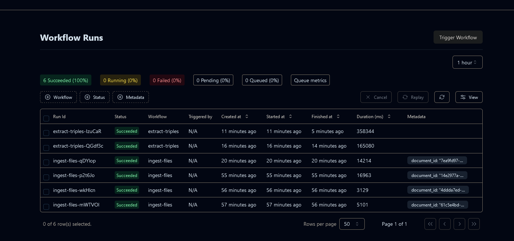

### Features Update: RAG-Enhancing KORA 

Here's the rundown of what RAG technology is, and how KORA will be developing alongside its capabilities:

---

#### **Rundown of RAG**  
Generally - RAG a.k.a **"Retrieval Augmented Generation"** uses the logic of retrieving relevant information in order to assist/build upon/improve responses generated by LLM's. 
This enables a models base knowledge to be sort of 'improved' within certain defined areas, and is a very popular & useful capability of RAG that enables more efficient workflows surrounding model deployment

The general gist is that information such as text, images, documents can be stored in a database that is referenced during test-time for example Q/A, Web-Search, or RAG-Agent (Agentic). There is a calculated similarity within relevant documents that determine which are pulled into context for the base model to use as a part of its answer.

 

---

#### **1. Ingesting documents with inference**  
For RAG to function, relevant information needs to be embedded into a database to be available for retrieval. This can be carried out in a few ways e.g. searching the web, or rather querying a local / predetermined vector db. For KORA, we're looking at a couple use-cases. Namely students uploading their own documents e.g. past exams, relevant knowledge to topics, and larger institutes who are looking to create a personalised / private / relevant database may it be of subject resources (exams, topics), documentation, news, libraries etc. Both of which have direct ability to take advantage of quick & easy access to both domain-specific + relevant information in need.

Knowing this, internal ingestion setup & tests prove to support this vision in the close future. Combining ingestion with multiple representational forms e.g Relationships, Communities will allow users to upload their data for their RAG requests in accordance to plan limits.  

---

#### **2. Chat functionality with Agent**  
A RAG Agent builds upon simple Q/A interactions with internal reasoning that determines the best course to retrieving data for a response. Web-interaction is supported with this function and based on user's input; will be utilised appropriately.

 

KORA will initially implement this with Exam Review sessions as students figuring out questions may converse to reach understanding of certain topics / questions missed. Previous similar examples (with answers optimally) can be used to determine familiar courses of action to answering correctly.

---

#### **3. Relationships within data**  
Data can be visualised / represented in quite a few ways. Some forms prove useful sometimes for finding less apparent relationships which in turn are able to be referenced for further context in datasets. Internally, Knowledge Graphs (KG) triplets, KG Communities, Relationships, Entities are some non-vector similarities that are drawn from ingested data. These will be utilised with KORA for better understanding & responses regarding external / uploaded data, more focused on information-loaded documents that suggest rules & context to keep in mind. 

KG Graph Communities & Collections enable:
1. Deeper/hidden connection discovery
2. Semantic topic clustering
3. Improved knowledge navigation
4. Removing duplicate entities & relationships in KG's
5. Graph-wide analysis

---

#### **4. Extras**  

* HyDE algorithm for RAG  [credit](https://r2r-docs.sciphi.ai/documentation/advanced-rag)
  * Generating hypothetical answers / documents on user prompt
  * Especially useful for limited-data scenarios 

* Semantic search - indexing RAG retrieval candidates pre re-ranker
  * Finding information based on *meaning* of query, not just pure token wording

* Hatchet working with workflow
  * Managing current events, admin, debugging/request inspection
  
   
---

This was an insight into an important feature / whats to come. Stay tuned as we continue pushing toward our next milestones! 
